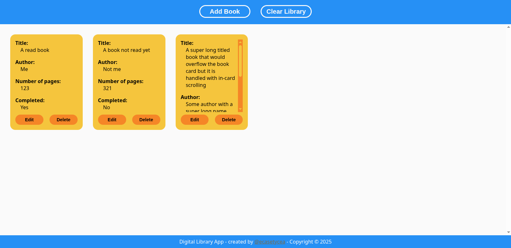
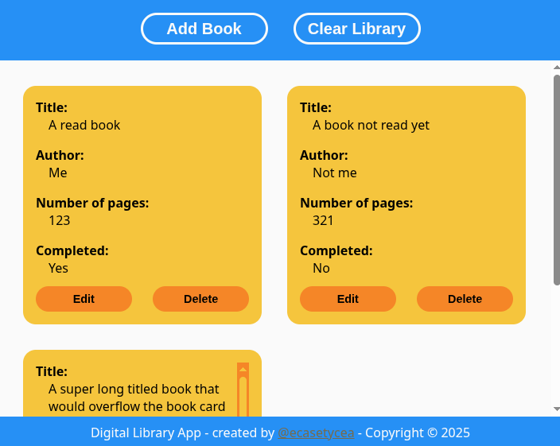

# Library App
A small and simple, fully front-end digital library app that keeps track
of the books you add to it. It includes basic info such as title, author, number
of pages and if you've read the book or not.

It uses just html, css and javascript, including localStorage to store the books
between browser sessions. No account creation needed.

This project was created for personal practice. It can find use in the real world,
so it's not just a toy, while still not being too big or ambitious that I would
abandon it due to lack of time.
If you find something broken, please open an issue. Since this is a practice
project, contributions are not accepted and PRs won't be merged.

## TODO:
- Add functionality to download your library as a file using only JS
and no server-side processing.
- File parsing to restore your library in another machine.

## Mishaps(?):
- For some reason github cannot deploy the latest change making the save button
invisible. Will fix it when I have more time available.

## Screenshots

